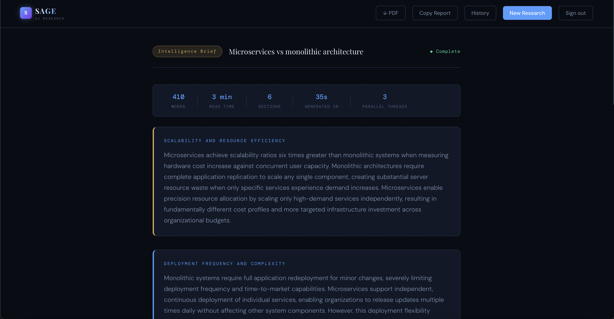

# ◆ Sage — AI Research Synthesizer

> **Ask anything. Understand everything.**

Sage is a production-grade AI research platform that decomposes any topic into parallel research threads, grounds findings in real-time web data, and delivers a structured intelligence brief in under 45 seconds — built entirely on AWS serverless infrastructure.

     

**🌐 Live:** [https://d1kbvlvilht945.cloudfront.net](https://d1kbvlvilht945.cloudfront.net) · **Repo:** [sage-research-synthesizer](https://github.com/srashtigupta-25/sage-research-synthesizer)


---

## What Sage Does

Submit any topic — technical, financial, scientific, historical, or current events. Sage runs 3 parallel AI research threads grounded in live web data and synthesizes a structured intelligence brief with domain-aware formatting, delivered in under 45 seconds.

Generates **350–900 word structured reports** using **3 parallel AI threads** — financial topics get investment-style analysis, technical topics get engineering deep-dives, scientific topics get mechanism breakdowns.

**Try it:**
- `"RCB winning IPL 2026 — what were their strengths"`
- `"Nvidia investment thesis 2025"`
- `"How CRISPR gene editing works - 2 page report"`
- `"What caused the 2008 financial crisis - executive summary"`

---

## Architecture

```
POST /reports
│
▼
API Gateway → Cognito JWT Auth → Lambda (Orchestrator)
│
Validates · Writes DynamoDB · Starts Pipeline
│
▼
Step Functions: SagePipeline
│
├─ State 1: Decompose (Claude Haiku 4.5)
│          topic → 3 precise sub-questions
│
├─ State 2: Research × 3 (Map state — true parallel)
│          Tavily web search + Claude Haiku 4.5
│          3 Lambda instances run simultaneously
│
├─ State 3: Generate Report (Claude Haiku 4.5)
│          Synthesizes research into structured brief
│          Detects custom length instructions
│
├─ State 4: Generate Images (S3)
│
└─ State 5: Persist → DynamoDB (status: COMPLETE)
Frontend polls GET /reports/{id} every 3s until COMPLETE (~45s avg)
Deployed on S3 + CloudFront — global CDN, HTTPS, edge caching

```
---

## AWS Services

| Service | Role |
|---|---|
| **API Gateway** | REST API — POST, GET, DELETE /reports with JWT authorization |
| **AWS Lambda** | 9 serverless Java 25 functions — zero server management |
| **Step Functions** | 5-state chain-of-thought pipeline with parallel Map execution |
| **Amazon Bedrock** | Claude Haiku 4.5 — decompose, research, synthesize |
| **DynamoDB** | On-demand NoSQL — per-user report isolation, UUID-addressed |
| **S3** | Frontend static hosting + generated image storage |
| **CloudFront** | Global CDN — HTTPS, edge caching, worldwide low latency |
| **Cognito** | User signup, email verification, JWT tokens, API authorization |

---

## Tech Stack

```
Backend    Java 25 · AWS SDK v2 · Maven · Pure Lambda handlers (no Spring)
Frontend   React 18 · Vite · Axios · Amazon Cognito Identity JS · jsPDF
Auth       Cognito User Pools + API Gateway JWT Authorizer
Database   DynamoDB on-demand — per-user report isolation
Pipeline   Step Functions Standard Workflow (Amazon States Language)
AI Model   Claude Haiku 4.5 on Amazon Bedrock (us-east-1 inference profile)
Web Search Tavily API — real-time grounded research (1000 req/month free)
Hosting    S3 static website + CloudFront CDN (global edge network)

```
---

## Features

| Feature | Details |
|---|---|
| **Real-time research** | Tavily web search grounds every report in current web data |
| **Any topic** | Technical, financial, scientific, historical, current events |
| **Custom report length** | "500 word report", "2 page report", "executive summary" |
| **Parallel AI threads** | 3 Lambda functions run simultaneously — ~60% faster than sequential |
| **Signup / Login** | Full Cognito auth with email verification flow |
| **Per-user history** | Each user sees only their own reports fetched from DynamoDB |
| **Download PDF** | Professional PDF export with branded header and section formatting |
| **Delete reports** | Removes from DynamoDB + local cache with confirmation modal |
| **Smart validation** | Rejects vague, real-time prices, personal advice, inappropriate topics |
| **JWT secured** | Every API endpoint protected via Cognito authorizer |
| **Mobile responsive** | Full support across all screen sizes |

---

## Engineering Decisions

**Java 25 over Python**
Strong typing catches errors at compile time, not runtime. AWS SDK v2 for Java provides enterprise-grade clients with built-in retry logic. Matches real-world backend engineering standards. Cold start ~1.5s is acceptable for this use case given the 45s total generation time.

**Step Functions over a single Lambda**
Clean separation of concerns — each Lambda does exactly one thing. The Map state enables true parallel execution of 3 research threads simultaneously, cutting research time ~60% vs sequential. State machine provides built-in retry logic, execution history, and visual debugging.

**Tavily over Bedrock native web search**
Bedrock's native `web_search_20250305` tool is not supported on Claude Haiku 4.5 — returns HTTP 400. Tavily provides 1,000 free searches/month, returns structured JSON with source URLs, and integrates cleanly via REST inside the research Lambda with graceful fallback to training data.

**DynamoDB over RDS**
Reports are accessed by UUID with zero relational joins needed. On-demand billing means $0 at zero traffic with automatic scaling under load. Schema flexibility allows adding fields without migrations.

**Polling over WebSockets**
3-second polling is simpler, more reliable, and sufficient for 45-second generation times. WebSockets require API Gateway WebSocket APIs, connection state management, and reconnection logic — significant complexity with minimal UX benefit at this scale.

**S3 + CloudFront over GitHub Pages**
End-to-end AWS deployment demonstrates real production architecture — the same pattern used by companies serving billions of requests. CloudFront provides HTTPS, global edge caching across 400+ locations, and sub-50ms load times worldwide.

**WAF deferred**
Architecture designed with SageWebACL using Amazon IP reputation list + AWS Core Rule Set. Deferred deployment to avoid $7/month cost on a portfolio project — a documented, conscious engineering trade-off for production readiness.

---

## Topic Validation

| Type | Example | Error |
|---|---|---|
| Too short | `"AI"` | TOPIC_TOO_SHORT |
| Too vague | `"life"` | TOPIC_TOO_VAGUE |
| Real-time prices | `"Apple stock price today"` | REALTIME_DATA_REQUEST |
| Personal advice | `"Should I invest in Tesla"` | PERSONAL_ADVICE_REQUEST |
| Inappropriate | `"How to make bomb"` | INAPPROPRIATE_TOPIC |

---

## Project Structure

```

sage-research-synthesizer/
├── lambdas/src/main/java/com/sage/
│   ├── orchestrator/      POST /reports — validates, writes DynamoDB, starts pipeline
│   ├── decompose/         State 1 — Claude decomposes topic into 3 sub-questions
│   ├── research/          State 2 — Tavily search + parallel Claude research
│   ├── generatereport/    State 3 — synthesizes structured intelligence brief
│   ├── generateimages/    State 4 — image generation
│   ├── persist/           State 5 — writes COMPLETE status to DynamoDB
│   ├── getreport/         GET /reports/{id} — polling endpoint
│   ├── deletereport/      DELETE /reports/{id} — removes from DynamoDB
│   └── listreports/       GET /reports — lists reports for authenticated user
├── frontend/src/
│   ├── App.jsx            All screens and components (Landing, Auth, Research, Report, History)
│   ├── App.css            Design system — dark theme, CSS variables, animations
│   ├── api.js             Axios client with automatic JWT injection
│   ├── auth.js            Cognito signup, email verify, signin, signout
│   └── config.js          AWS resource configuration
└── step_functions/
└── state_machine.json Amazon States Language pipeline definition

```
---

## Running Locally

```bash
# Frontend
cd frontend
npm install
npm run dev
# Open http://localhost:5173

# Backend — build JAR and upload to each Lambda
cd lambdas
mvn clean package
# Upload target/sage-lambdas-1.0.jar to each Lambda via AWS Console
```

**AWS resources required:**
- DynamoDB table `SageReports` (partition key: `reportId`)
- Cognito User Pool + App Client with self-registration enabled
- API Gateway REST API with Cognito JWT Authorizer
- Step Functions state machine `SagePipeline`
- IAM roles `SageLambdaRole` + `SageSFRole`
- S3 buckets — `sage-images-{account-id}` (images) + `sage-app-{account-id}` (frontend)
- CloudFront distribution pointing to frontend S3 bucket

---

## Deploying Frontend Updates

```bash
cd frontend
npm run build
aws s3 sync dist/ s3://sage-app-758854590072 --delete
aws cloudfront create-invalidation --distribution-id E3LFVB7IWLHHDK --paths "/*"
```

---

## Cost Estimate

| Service | Monthly Cost (1000 reports) |
|---|---|
| Lambda (9 functions) | ~$0.00 (free tier) |
| Step Functions | ~$0.025 |
| Bedrock (Claude Haiku 4.5) | ~$2.00 |
| Tavily web search | ~$0.00 (free tier — 1000 searches) |
| DynamoDB | ~$0.00 (free tier) |
| S3 + CloudFront | ~$0.00 (free tier) |
| API Gateway | ~$0.035 |
| **Total** | **~$2.10/month** |

---

## Roadmap

- **Document analysis** — PDF/Word upload analyzed through the same pipeline
- **Real image generation** — Nova Canvas or Stability AI when models activate
- **Streaming responses** — real-time token streaming instead of 3s polling
- **Public report sharing** — shareable URLs for generated reports
- **Rate limiting** — per-user request throttling at API Gateway level

---

## Author

**Srashti Gupta** · MS Computer Science, Northeastern University · 5+ years backend engineering (NAB, IBM)

[Portfolio](https://srashtigupta-25.github.io) · [LinkedIn](https://linkedin.com/in/srashtigupta)

---

*Demonstrating AWS serverless architecture, AI pipeline engineering, real-time web search integration, and full-stack development.*
